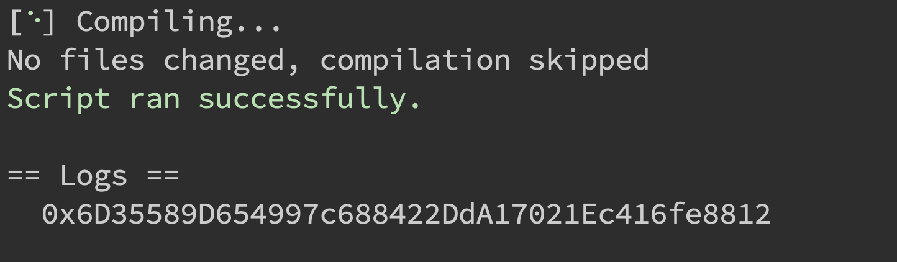
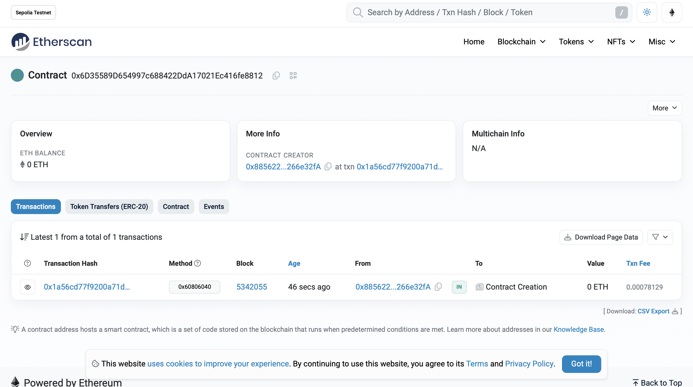

# 2024-Spring-HW0

All the detailed specified in Homework 0 documentation.

## Wallet Address
Please provide your MetaMask wallet address:
0x8856226537585B443206Db42ABc40357266e32fA

## Local Testing
Please provide a screenshot of the `forge test -vvv` command running in your local environment.

## Contract Address
Please provide the contract address that you deployed on the Sepolia network.
0x6D35589D654997c688422DdA17021Ec416fe8812

## Sepolia Etherscan
Paste the contract address into the Sepolia Etherscan and share the screenshot.

